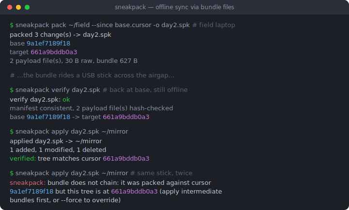
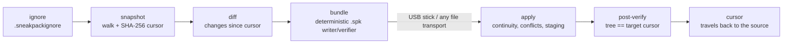

# sneakpack

[English](README.md) | [中文](README.zh.md) | [日本語](README.ja.md)

[](LICENSE) [](go.mod) [](CHANGELOG.md)  [](CONTRIBUTING.md)

**sneakpack：ディレクトリの配達人となるオープンソースツール — カーソル以降の変更を検証可能な単一バンドルファイルに詰め、何ででも運び、オフラインで適用・検証する。**



```bash
git clone https://github.com/JaydenCJ/sneakpack.git && cd sneakpack && go install ./cmd/sneakpack
```

> プレリリース：v0.1.0 はまだ module proxy のタグとして公開されていないため、上記のとおりソースからインストールしてください。単一の静的バイナリで、実行時依存はゼロです。

## なぜ sneakpack？

2 つのディレクトリの同期は、間にケーブルか VPN かクラウドがある限り、とうに解決済みの問題です。しかしネットワークが消えると（エアギャップ環境の工場、フィールド観測拠点、月に一度しか帰港しない調査船）、ツール群は総崩れになります。rsync は差分計算に生きた接続を要求し、git bundle は発想こそ完璧でも git リポジトリ専用、そして事実上の標準である「フォルダごと zip して USB メモリへ」は、変わっていない数 GB を毎回コピーし、削除を黙って取りこぼし、メモリの中身が道中で壊れていないかを知るすべもありません。sneakpack は git bundle のモデルを*任意の*ディレクトリへ広げます。宛先の状態は**カーソル**（ファイルマニフェストの内容アドレス化ハッシュ）で表され、送り元はそのカーソル以降の変更だけを決定的な `.spk` ファイルへ詰め、宛先は全バイトを検証し、順序違いのバンドルやローカル編集を潰すバンドルを拒否し、適用後には自分のツリーが送り元とハッシュ単位で一致することを証明します。

| | sneakpack | rsync | git bundle | USB メモリの zip/tar |
| --- | --- | --- | --- | --- |
| 生きた接続が必要 | 不要 — ファイルが旅をする | 差分同期には必要 | 不要 | 不要 |
| 任意のディレクトリで動く | はい | はい | git リポジトリのみ | はい |
| 変更分だけを運ぶ | はい、カーソルとの diff | はい（オンライン限定） | はい、ref 以降 | いいえ、毎回全部 |
| 削除を伝播する | はい、ハッシュで保護 | `--delete`、保護なし | はい | いいえ |
| 転送中の損傷を検出 | 全ファイル SHA-256 検査 | 対象外（ライブプロトコル） | pack チェックサム | いいえ |
| 順序違い・再投函を拒否 | はい、カーソルチェーン | 対象外 | ref 検査 | いいえ |
| 宛先のローカル編集を保護 | はい、競合停止 + `--force` | 黙って上書き | 対象外（merge） | 黙って上書き |
| 実行時依存 | なし（Go 標準ライブラリ、単一バイナリ） | rsync + ssh | git | zip/tar |

<sub>比較は 2026-07 時点の各上流ドキュメントに基づきます。rsync の `--only-write-batch` もオフラインで差分を記録できますが、宛先の生きたコピーに対して生成する必要があり、適用は盲目的 — カーソルも検証も競合停止もありません。</sub>

## 特徴

- **カーソルベースの増分** — カーソルはツリーのファイルマニフェストの SHA-256 アイデンティティ。同一内容のツリーはどのマシンでも同じハッシュになるため、「相手側には何がある？」は 1 本の文字列で済み、プロトコルは要りません。
- **検証可能な単一ファイル** — バンドルは変更セット、全ペイロードのハッシュ、完全なターゲットマニフェストを携行。`verify` はネットワークもどちらのツリーの複製も持たないマシン上で健全性を証明します。
- **チェーンの完全性** — どのバンドルも梱包時の基準カーソルを記録。順序違い・二重適用・別ツリーへの適用は双方の ID を名指しして拒否され、黙って呑み込まれることはありません。
- **ローカル編集は安全** — 変更・削除対象のファイルは宛先が持っているはずのハッシュを携行。ローカルの改変は名指しの競合として apply を止め（`--force` と言わない限り）、`--dry-run` で全容を試写できます。
- **全か無かの適用** — ペイロードはまず `.sneakpack/` 内にステージしてハッシュ検査し、それからファイルを動かします。最後にツリー全体を再走査し、約束のカーソルとバイト単位で一致することを証明します。
- **決定的なバンドル** — タイムスタンプのゼロ化と正準順序により、再梱包はバイト同一のファイルを生みます。配達人もスクリプトも素の内容ハッシュで重複排除できます。
- **依存ゼロ、ネットワークゼロ** — 純粋な Go 標準ライブラリ製の静的バイナリで、ローカルファイルの読み書きしかしません。自身のテストは 90 のオフラインケースとエンドツーエンドの smoke スクリプトです。

## クイックスタート

送り元マシンでまずツリー全体を梱包し、カーソルを手元に残します：

```bash
mkdir -p field/notes && echo "day one" > field/notes/day1.md
printf 'id,temp\n1,20.5\n' > field/readings.csv

sneakpack pack field --full -o full.spk --cursor-out base.cursor
mkdir mirror && sneakpack apply full.spk mirror   # "mirror" stands in for the far machine
```

実際の実行出力：

```text
packed 2 change(s) -> full.spk
  base   e3b0c44298fc
  target 9a1ef7189f18
  2 payload file(s), 23 B raw, bundle 532 B
  cursor -> base.cursor
applied full.spk -> mirror
  2 added, 0 modified, 0 deleted
  verified: tree matches cursor 9a1ef7189f18
```

作業は普段どおり。あとはカーソル以降の変更だけを梱包し、その 1 ファイルを運びます：

```bash
echo "day two" > field/notes/day2.md
printf 'id,temp\n1,20.5\n2,21.0\n' > field/readings.csv
rm field/notes/day1.md

sneakpack status field --since base.cursor   # exits 1 when there is something to pack
sneakpack pack field --since base.cursor -o day2.spk
sneakpack verify day2.spk                    # e.g. after the USB stick arrives
sneakpack apply day2.spk mirror
```

実際の実行出力：

```text
A  notes/day2.md (8 B)
M  readings.csv (22 B)
D  notes/day1.md
3 change(s) since cursor 9a1ef7189f18: 1 added, 1 modified, 1 deleted
packed 3 change(s) -> day2.spk
  base   9a1ef7189f18
  target 661a9bddb0a3
  2 payload file(s), 30 B raw, bundle 627 B
verify day2.spk: ok
  manifest consistent, 2 payload file(s) hash-checked
  base 9a1ef7189f18 -> target 661a9bddb0a3
applied day2.spk -> mirror
  1 added, 1 modified, 1 deleted
  verified: tree matches cursor 661a9bddb0a3
```

同じバンドルを二度適用すると、チェーン保護がこう答えます：`bundle does not chain: it was packed against cursor 9a1ef7189f18 but this tree is at 661a9bddb0a3 (apply intermediate bundles first, or --force to override)`。ループを閉じるには `sneakpack cursor mirror -o back.cursor` で宛先のカーソルを持ち帰り用に書き出します — 往復を省いて `--cursor-out` を楽観的に信頼しても構いません。

## コマンドリファレンス

| コマンド | 役割 |
| --- | --- |
| `snapshot <dir> [-o f]` | ツリーのカーソルをファイルへ書く（省略時は JSON を stdout へ） |
| `status <dir> [--since f]` | カーソル以降の変更を列挙。変更があれば終了コード 1 |
| `pack <dir> -o b.spk --since f \| --full` | 変更をバンドルへ封入。`--cursor-out` で新カーソルも保存 |
| `inspect <b.spk>` | バンドルのカーソルと変更一覧を表示。何も触らない |
| `verify <b.spk>` | 完全なオフライン検査：マニフェスト整合 + 全ペイロードのハッシュ |
| `apply <b.spk> <dir>` | 検証し、連続性と競合を確認し、着地させ、ツリーを再検証 |
| `cursor <dir> [-o f]` | 宛先の現在カーソルを持ち帰り用に書き出す |

apply のフラグ（すべてデフォルト無効）：

| キー | 既定値 | 効果 |
| --- | --- | --- |
| `--dry-run` | off | 計画とすべての競合を報告し、何も変更しない（競合時は終了コード 1） |
| `--force` | off | 連続性・競合の検出を乗り越えて続行し、ローカル編集を上書き |
| `--no-verify` | off | 適用後のツリー再走査を省略（遅い媒体上の巨大ツリー向け） |

終了コードは全コマンド共通：`0` 正常/クリーン、`1` 実際の差異（未梱包の変更、検証失敗、チェーン断絶、競合）、`2` 用法または I/O エラー。送り元ルートの `.sneakpackignore`（gitignore 風サブセット：ベース名と anchored glob、`**`、`dir/`、`!` 否定）が作業ファイルをバンドルから締め出します — このファイル自体がツリーと共に同期されるため、両側の認識は常に一致します。フォーマットの詳細は [docs/bundle-format.md](docs/bundle-format.md)。

## アーキテクチャ



`pack` は左半分を走って封をしたファイルで止まります。`apply` は最初の 1 バイトが着地する前にバンドルの主張をすべて検証し、着地後にツリーを再走査して約束が守られたことを証明します。

## ロードマップ

- [x] v0.1.0 — snapshot/status/pack/inspect/verify/apply/cursor、内容アドレス化カーソルチェーン、`--force`/`--dry-run` 付き競合検出、ステージング式の全か無か適用、決定的バンドル、ignore ファイル、依存ゼロ、90 テスト + smoke スクリプト
- [ ] `pack --limit-size`：変更セットを媒体サイズごとの複数バンドルに分割
- [ ] 敵対的配達人を想定した任意の age/minisign 式バンドル署名
- [ ] Windows 対応：パス処理と exec ビットのポリシー
- [ ] シンボリックリンクの携行（現在は警告付きでスキップ）
- [ ] `apply --keep-conflicts`：停止する代わりに `.theirs` ファイルを書き出す

全リストは [open issues](https://github.com/JaydenCJ/sneakpack/issues) を参照。

## コントリビュート

バグ報告・フォーマットの提案・PR を歓迎します — ローカルの手順は [CONTRIBUTING.md](CONTRIBUTING.md) を参照（`go test ./...` と、`SMOKE OK` を印字する `scripts/smoke.sh`。本リポジトリは意図的に CI を持ちません）。入口には [good first issue](https://github.com/JaydenCJ/sneakpack/issues?q=is%3Aissue+is%3Aopen+label%3A%22good+first+issue%22) のラベルがあり、設計の議論は [Discussions](https://github.com/JaydenCJ/sneakpack/discussions) で行っています。

## ライセンス

[MIT](LICENSE)
