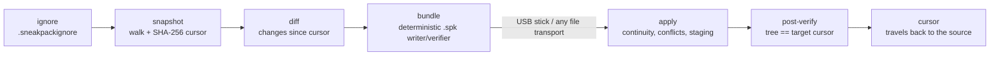

# sneakpack

[English](README.md) | [中文](README.zh.md) | [日本語](README.ja.md)

[](LICENSE) [](go.mod) [](CHANGELOG.md)  [](CONTRIBUTING.md)

**sneakpack：an open-source courier for directories — pack the changes since a cursor into one verifiable bundle file, carry it on anything, apply and verify offline.**


```bash
git clone https://github.com/JaydenCJ/sneakpack.git && cd sneakpack && go install ./cmd/sneakpack
```

> Pre-release: v0.1.0 is not yet published to a module proxy tag; install from source as above. A single static binary, no runtime dependencies.

## Why sneakpack?

Syncing two directories is a solved problem — as long as a cable, a VPN or a cloud sits between them. Take the network away (an airgapped plant, a field station, a research vessel that sees shore once a month) and the tooling collapses: rsync needs a live connection to compute its deltas, git bundle does exactly the right thing but only for git repositories, and the de-facto standard — "zip the whole folder onto a USB stick" — copies gigabytes that didn't change, silently misses deletions, and offers no way to know whether the stick's contents survived the trip. sneakpack applies git bundle's model to *any* directory: the destination's state is a **cursor** (a content-addressed hash of its file manifest), the source packs exactly what changed since that cursor into one deterministic `.spk` file, and the destination verifies every byte, refuses bundles that arrive out of order or would overwrite local edits, and proves after applying that its tree now matches the source hash-for-hash.

| | sneakpack | rsync | git bundle | zip/tar on a stick |
| --- | --- | --- | --- | --- |
| Needs a live connection | no — a file travels | yes, for delta sync | no | no |
| Works on any directory | yes | yes | git repositories only | yes |
| Carries only the changes | yes, diffed against a cursor | yes (online only) | yes, since a ref | no, everything again |
| Propagates deletions | yes, hash-guarded | `--delete`, unguarded | yes | no |
| Detects a damaged transfer | every file SHA-256-checked | n/a (live protocol) | pack checksums | no |
| Refuses out-of-order/replayed drops | yes, cursor chain | n/a | ref checks | no |
| Protects local edits at the destination | yes, conflict stop + `--force` | overwrites silently | n/a (merge) | overwrites silently |
| Runtime dependencies | none (Go stdlib, one binary) | rsync + ssh | git | zip/tar |

<sub>Comparison reflects upstream documentation as of 2026-07. rsync's `--only-write-batch` can record a delta offline, but it must be produced against a live copy of the destination and applies blind, with no cursor, verification, or conflict stop.</sub>

## Features

- **Cursor-based increments** — a cursor is the SHA-256 identity of a tree's file manifest; identical trees hash identically on any machine, so "what does the other side have?" is one string, not a protocol.
- **One verifiable file** — a bundle carries the change set, every payload's hash, and the full target manifest; `verify` proves it sound on a machine with no network and no copy of either tree.
- **Chain integrity** — every bundle records the cursor it was packed against; applying one out of order, twice, or onto the wrong tree is refused with both IDs named, never silently absorbed.
- **Local edits are safe** — modified and deleted files carry the hash the destination should hold; a local edit stops the apply as a named conflict unless you say `--force`, and `--dry-run` previews everything.
- **All-or-nothing applies** — payloads are staged and hash-checked inside `.sneakpack/` before a single file moves, then the whole tree is re-walked to prove it matches the promised cursor byte for byte.
- **Deterministic bundles** — zeroed timestamps and canonical ordering make repeated packs byte-identical, so couriers and scripts can deduplicate drops by plain content hash.
- **Zero dependencies, zero network** — pure Go stdlib, one static binary that only ever reads and writes local files; its own suite is 90 offline tests plus an end-to-end smoke script.

## Quickstart

On the source machine, pack the whole tree once and keep the cursor:

```bash
mkdir -p field/notes && echo "day one" > field/notes/day1.md
printf 'id,temp\n1,20.5\n' > field/readings.csv

sneakpack pack field --full -o full.spk --cursor-out base.cursor
mkdir mirror && sneakpack apply full.spk mirror   # "mirror" stands in for the far machine
```

Real captured output:

```text
packed 2 change(s) -> full.spk
  base   e3b0c44298fc
  target 9a1ef7189f18
  2 payload file(s), 23 B raw, bundle 532 B
  cursor -> base.cursor
applied full.spk -> mirror
  2 added, 0 modified, 0 deleted
  verified: tree matches cursor 9a1ef7189f18
```

Work happens; later, pack only what changed since the cursor and carry that:

```bash
echo "day two" > field/notes/day2.md
printf 'id,temp\n1,20.5\n2,21.0\n' > field/readings.csv
rm field/notes/day1.md

sneakpack status field --since base.cursor   # exits 1 when there is something to pack
sneakpack pack field --since base.cursor -o day2.spk
sneakpack verify day2.spk                    # e.g. after the USB stick arrives
sneakpack apply day2.spk mirror
```

Real captured output:

```text
A  notes/day2.md (8 B)
M  readings.csv (22 B)
D  notes/day1.md
3 change(s) since cursor 9a1ef7189f18: 1 added, 1 modified, 1 deleted
packed 3 change(s) -> day2.spk
  base   9a1ef7189f18
  target 661a9bddb0a3
  2 payload file(s), 30 B raw, bundle 627 B
verify day2.spk: ok
  manifest consistent, 2 payload file(s) hash-checked
  base 9a1ef7189f18 -> target 661a9bddb0a3
applied day2.spk -> mirror
  1 added, 1 modified, 1 deleted
  verified: tree matches cursor 661a9bddb0a3
```

Apply the same bundle twice and the chain protection answers: `bundle does not chain: it was packed against cursor 9a1ef7189f18 but this tree is at 661a9bddb0a3 (apply intermediate bundles first, or --force to override)`. To close the loop, `sneakpack cursor mirror -o back.cursor` exports the destination's cursor for the trip home — or skip the round trip and trust `--cursor-out` optimistically.

## Command reference

| Command | Does |
| --- | --- |
| `snapshot <dir> [-o f]` | write the tree's cursor to a file (or stdout as JSON) |
| `status <dir> [--since f]` | list changes since a cursor; exit 1 if any |
| `pack <dir> -o b.spk --since f \| --full` | seal the changes into a bundle; `--cursor-out` keeps the new cursor |
| `inspect <b.spk>` | print a bundle's cursors and change list, touching nothing |
| `verify <b.spk>` | full offline check: manifest consistency + every payload hash |
| `apply <b.spk> <dir>` | verify, check continuity and conflicts, land, re-verify the tree |
| `cursor <dir> [-o f]` | export a destination's current cursor for the trip back |

Apply flags, all off by default:

| Key | Default | Effect |
| --- | --- | --- |
| `--dry-run` | off | report the plan and any conflicts, change nothing (exit 1 on conflicts) |
| `--force` | off | proceed past continuity and conflict findings, overwriting local edits |
| `--no-verify` | off | skip the post-apply tree walk (large trees on slow media) |

Exit codes everywhere: `0` ok/clean, `1` a real difference (changes pending, verification failed, chain broken, conflicts), `2` usage or I/O error. A `.sneakpackignore` at the source root (gitignore-style subset: basename and anchored globs, `**`, `dir/`, `!` negation) keeps scratch files out of bundles — and travels with the tree, so both sides agree. Formats are documented in [docs/bundle-format.md](docs/bundle-format.md).

## Architecture



`pack` runs the left half and stops at the sealed file; `apply` verifies everything the bundle claims before the first byte lands, and re-walks the tree afterwards to prove the promise was kept.

## Roadmap

- [x] v0.1.0 — snapshot/status/pack/inspect/verify/apply/cursor, content-addressed cursor chain, conflict detection with `--force`/`--dry-run`, staged all-or-nothing applies, deterministic bundles, ignore files, zero dependencies, 90 tests + smoke script
- [ ] `pack --limit-size` to split a change set across several media-sized bundles
- [ ] Optional age/minisign-style bundle signing for hostile-courier settings
- [ ] Windows support: path handling and an exec-bit policy
- [ ] Symlink carrying (currently skipped with a warning)
- [ ] `apply --keep-conflicts` writing `.theirs` files instead of stopping

See the [open issues](https://github.com/JaydenCJ/sneakpack/issues) for the full list.

## Contributing

Bug reports, format ideas and pull requests are welcome — see [CONTRIBUTING.md](CONTRIBUTING.md) for the local workflow (`go test ./...` plus `scripts/smoke.sh` printing `SMOKE OK`; the repository intentionally ships no CI). Good entry points are labelled [good first issue](https://github.com/JaydenCJ/sneakpack/issues?q=is%3Aissue+is%3Aopen+label%3A%22good+first+issue%22), and design questions live in [Discussions](https://github.com/JaydenCJ/sneakpack/discussions).

## License

[MIT](LICENSE)
