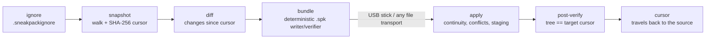

# sneakpack

[English](README.md) | [中文](README.zh.md) | [日本語](README.ja.md)

[](LICENSE) [](go.mod) [](CHANGELOG.md)  [](CONTRIBUTING.md)

**sneakpack：开源的目录信使 — 把自某个游标以来的变更打进一个可校验的 bundle 文件，随便什么介质带走，离线应用并验证。**


```bash
git clone https://github.com/JaydenCJ/sneakpack.git && cd sneakpack && go install ./cmd/sneakpack
```

> 预发布：v0.1.0 尚未发布 module proxy 标签，请按上述方式从源码安装。单个静态二进制，零运行时依赖。

## 为什么选 sneakpack？

只要两台机器之间还有网线、VPN 或云，目录同步早就是解决了的问题。可一旦网络消失（隔离网车间、野外观测站、一个月才靠一次岸的科考船），工具链就塌了：rsync 计算增量需要活连接，git bundle 思路完全正确却只服务 git 仓库，而事实上的标准做法——“整个文件夹打包塞 U 盘”——把没变的几个 GB 重复拷贝、悄悄漏掉删除，还无从得知 U 盘内容有没有在路上损坏。sneakpack 把 git bundle 的模型推广到*任意*目录：目的地的状态是一个**游标**（其文件清单的内容寻址哈希），源端把自该游标以来的变更精确打进一个确定性的 `.spk` 文件，目的地逐字节校验、拒绝乱序到达或会覆盖本地修改的 bundle，并在应用后证明自己的目录树与源端逐哈希一致。

| | sneakpack | rsync | git bundle | U 盘上的 zip/tar |
| --- | --- | --- | --- | --- |
| 需要活连接 | 不需要 — 传的是文件 | 增量同步需要 | 不需要 | 不需要 |
| 适用任意目录 | 是 | 是 | 仅 git 仓库 | 是 |
| 只携带变更 | 是，对游标做 diff | 是（仅在线） | 是，自某个 ref 起 | 否，每次全量 |
| 传播删除 | 是，带哈希保护 | `--delete`，无保护 | 是 | 否 |
| 检测传输损坏 | 每个文件 SHA-256 校验 | 不适用（在线协议） | pack 校验和 | 否 |
| 拒绝乱序/重放投递 | 是，游标链 | 不适用 | ref 检查 | 否 |
| 保护目的地的本地修改 | 是，冲突即停 + `--force` | 静默覆盖 | 不适用（merge） | 静默覆盖 |
| 运行时依赖 | 无（Go 标准库，单二进制） | rsync + ssh | git | zip/tar |

<sub>对比基于 2026-07 各上游文档。rsync 的 `--only-write-batch` 也能离线记录增量，但必须对着目的地的一份活副本生成，且应用时是盲打——没有游标、没有校验、没有冲突拦截。</sub>

## 特性

- **基于游标的增量** — 游标是目录文件清单的 SHA-256 身份；内容相同的树在任何机器上哈希相同，于是“对面有什么？”只是一个字符串，而不是一套协议。
- **一个可校验的文件** — bundle 携带变更集、每个载荷的哈希和完整的目标清单；`verify` 在一台既无网络也没有任何一棵树副本的机器上就能证明它完好。
- **链完整性** — 每个 bundle 都记录打包时依据的游标；乱序应用、重复应用或用错目录树都会被点名双方 ID 后拒绝，绝不静默吞掉。
- **本地修改是安全的** — 被修改和被删除的文件都带着目的地应持有的哈希；本地改动会以具名冲突拦停 apply，除非明说 `--force`，`--dry-run` 则可预览一切。
- **要么全部、要么不动** — 载荷先在 `.sneakpack/` 内暂存并逐哈希校验，之后才移动第一个文件，最后重扫全树，证明与承诺的游标逐字节一致。
- **确定性 bundle** — 时间戳归零、条目顺序规范化，重复打包产生逐字节相同的文件，信使和脚本可以直接按内容哈希去重。
- **零依赖、零网络** — 纯 Go 标准库，一个只读写本地文件的静态二进制；自身测试为 90 个离线用例外加端到端 smoke 脚本。

## 快速上手

在源机器上先全量打包一次，并留住游标：

```bash
mkdir -p field/notes && echo "day one" > field/notes/day1.md
printf 'id,temp\n1,20.5\n' > field/readings.csv

sneakpack pack field --full -o full.spk --cursor-out base.cursor
mkdir mirror && sneakpack apply full.spk mirror   # "mirror" stands in for the far machine
```

真实运行输出：

```text
packed 2 change(s) -> full.spk
  base   e3b0c44298fc
  target 9a1ef7189f18
  2 payload file(s), 23 B raw, bundle 532 B
  cursor -> base.cursor
applied full.spk -> mirror
  2 added, 0 modified, 0 deleted
  verified: tree matches cursor 9a1ef7189f18
```

工作照常进行；之后只打包自游标以来的变更，带走那一个文件：

```bash
echo "day two" > field/notes/day2.md
printf 'id,temp\n1,20.5\n2,21.0\n' > field/readings.csv
rm field/notes/day1.md

sneakpack status field --since base.cursor   # exits 1 when there is something to pack
sneakpack pack field --since base.cursor -o day2.spk
sneakpack verify day2.spk                    # e.g. after the USB stick arrives
sneakpack apply day2.spk mirror
```

真实运行输出：

```text
A  notes/day2.md (8 B)
M  readings.csv (22 B)
D  notes/day1.md
3 change(s) since cursor 9a1ef7189f18: 1 added, 1 modified, 1 deleted
packed 3 change(s) -> day2.spk
  base   9a1ef7189f18
  target 661a9bddb0a3
  2 payload file(s), 30 B raw, bundle 627 B
verify day2.spk: ok
  manifest consistent, 2 payload file(s) hash-checked
  base 9a1ef7189f18 -> target 661a9bddb0a3
applied day2.spk -> mirror
  1 added, 1 modified, 1 deleted
  verified: tree matches cursor 661a9bddb0a3
```

同一个 bundle 应用两次，链保护会回答：`bundle does not chain: it was packed against cursor 9a1ef7189f18 but this tree is at 661a9bddb0a3 (apply intermediate bundles first, or --force to override)`。要闭合回路，用 `sneakpack cursor mirror -o back.cursor` 导出目的地游标带回源端——或者省掉往返，乐观地信任 `--cursor-out`。

## 命令参考

| 命令 | 作用 |
| --- | --- |
| `snapshot <dir> [-o f]` | 把目录树的游标写入文件（或以 JSON 输出到 stdout） |
| `status <dir> [--since f]` | 列出自游标以来的变更；有变更则退出码 1 |
| `pack <dir> -o b.spk --since f \| --full` | 把变更封进 bundle；`--cursor-out` 顺手保存新游标 |
| `inspect <b.spk>` | 打印 bundle 的游标与变更清单，不动任何东西 |
| `verify <b.spk>` | 完整离线校验：清单自洽 + 每个载荷哈希 |
| `apply <b.spk> <dir>` | 校验、查链续与冲突、落地、再重验全树 |
| `cursor <dir> [-o f]` | 导出目的地当前游标，供带回源端 |

apply 的旗标，默认全部关闭：

| 键 | 默认 | 效果 |
| --- | --- | --- |
| `--dry-run` | 关 | 报告计划与所有冲突，不做任何修改（有冲突时退出码 1） |
| `--force` | 关 | 越过链续与冲突告警继续执行，覆盖本地修改 |
| `--no-verify` | 关 | 跳过应用后的全树重扫（慢介质上的大目录树） |

各处统一的退出码：`0` 正常/干净，`1` 真实差异（有待打包的变更、校验失败、链断、冲突），`2` 用法或 I/O 错误。源端根目录的 `.sneakpackignore`（gitignore 风格子集：基名与锚定 glob、`**`、`dir/`、`!` 反选）把临时文件挡在 bundle 之外——它随树同行，两侧因此永远一致。格式细节见 [docs/bundle-format.md](docs/bundle-format.md)。

## 架构



`pack` 只跑左半程，停在封好的文件上；`apply` 在第一个字节落地之前校验 bundle 的全部主张，落地之后再重扫全树，证明承诺兑现。

## 路线图

- [x] v0.1.0 — snapshot/status/pack/inspect/verify/apply/cursor、内容寻址的游标链、带 `--force`/`--dry-run` 的冲突检测、暂存式全有或全无 apply、确定性 bundle、ignore 文件、零依赖、90 个测试 + smoke 脚本
- [ ] `pack --limit-size`：把变更集拆成多个介质大小的 bundle
- [ ] 可选的 age/minisign 式 bundle 签名，应对不可信信使
- [ ] Windows 支持：路径处理与 exec 位策略
- [ ] 携带符号链接（当前跳过并告警）
- [ ] `apply --keep-conflicts`：写出 `.theirs` 文件而非直接拦停

完整列表见 [open issues](https://github.com/JaydenCJ/sneakpack/issues)。

## 参与贡献

欢迎缺陷报告、格式想法与 PR — 本地流程见 [CONTRIBUTING.md](CONTRIBUTING.md)（`go test ./...` 加上打印 `SMOKE OK` 的 `scripts/smoke.sh`；本仓库有意不带 CI）。入门任务标注为 [good first issue](https://github.com/JaydenCJ/sneakpack/issues?q=is%3Aissue+is%3Aopen+label%3A%22good+first+issue%22)，设计讨论在 [Discussions](https://github.com/JaydenCJ/sneakpack/discussions)。

## 许可证

[MIT](LICENSE)
